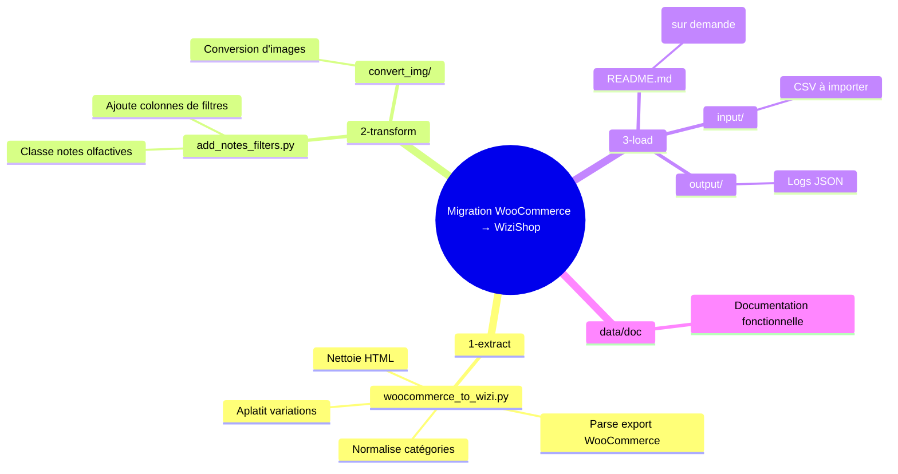

# Visuel du projet — Migration WooCommerce → WiziShop

Ce document donne une vue **visuelle et opérationnelle** du pipeline, pour comprendre le flux sans devoir lire tout le code.

## 1) Vue globale (ETL)

```mermaid
flowchart LR
    A[Export WooCommerce\nexport_webtoffe_woocommerce.csv] --> B[1-extract\nwoocommerce_to_wizi.py]
    B --> C[CSV converti\n3-load/input/woocommerce_converted_*.csv]
    C --> D[2-transform\nadd_notes_filters.py]
    D --> E[CSV enrichi\n3-load/input/woocommerce_converted_with_filters.csv]
    E --> F[3-load\nwizi_import_fasttry.py\n(script privé, sur demande)]
    F --> G[Boutique WiziShop\nProduits + catégories + filtres]
```

---

## 2) Ce que fait chaque étape

```mermaid
flowchart TD
    subgraph Extract
      E1[Lecture CSV WooCommerce]
      E2[Nettoyage HTML]
      E3[Images: extraction URL]
      E4[Catégories: normalisation 2 niveaux]
      E5[Variations: regroupement sur 1 ligne]
      E1 --> E2 --> E3 --> E4 --> E5
    end

    subgraph Transform
      T1[Lecture filtres existants WiziShop]
      T2[Classification notes\nTête / Cœur / Fond]
      T3[Colonnes ajoutées\n*_wizi et *_export]
      T1 --> T2 --> T3
    end

    subgraph Load
      L1[Pré-création catégories]
      L2[Import produits (parallèle)]
      L3[Association filtres]
      L4[Logs JSON]
      L1 --> L2 --> L3 --> L4
    end
```

---

## 3) Carte des fichiers clés



---

## 4) Mode d’emploi ultra-court

1. **Extraction** : convertir l’export WooCommerce.
2. **Transformation** : enrichir les notes olfactives.
3. **Chargement** : importer vers WiziShop (script privé).

> Astuce : ouvre ce fichier dans VS Code/GitHub pour voir les graphes Mermaid rendus automatiquement.

